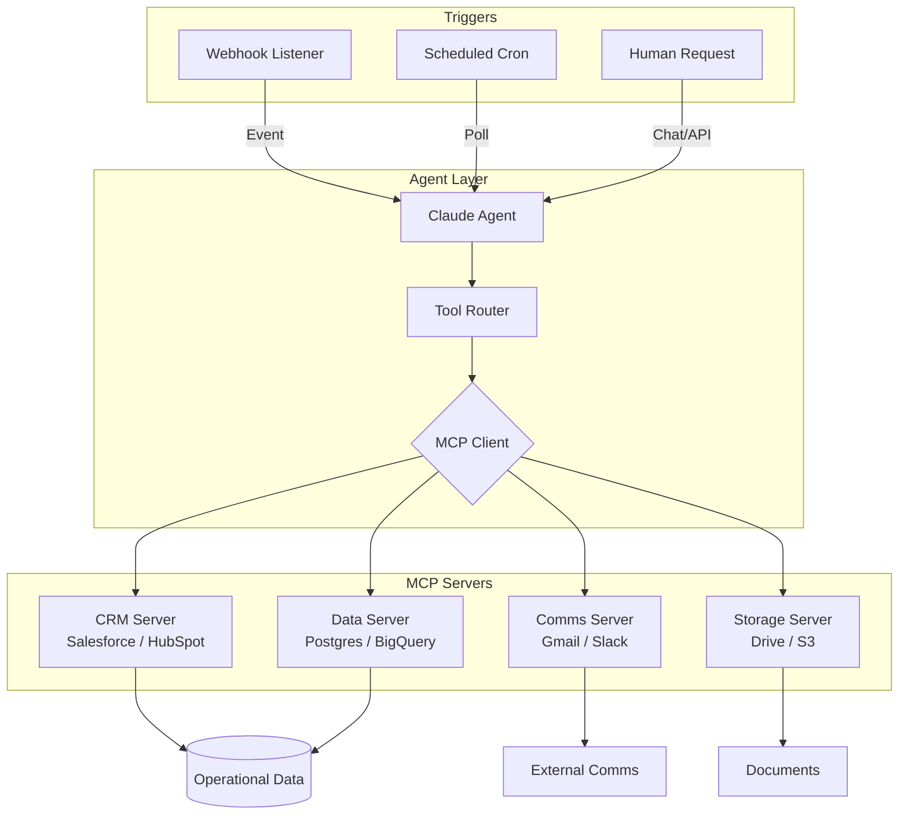

# Chapter 4: Connecting the Real World — Model Context Protocol and Tool Integrations

## The $14,000 CRM That Nobody Queries

A Series B SaaS company I audited last year paid $14,000 annually for Salesforce. Their SDR team logged 340 inbound leads per month. Average first-response time: 4.2 hours. Not because reps were lazy—because nobody had time to cross-reference HubSpot form submissions against LinkedIn profiles, enrich company data from Clearbit, check existing account records, and draft personalized replies before the lead went cold.

Their Claude agent could write excellent outreach copy. It lived in a browser tab. It could not *see* the CRM.

That gap—between reasoning capability and operational access—is where most agent projects die. The model understands what to do. It cannot reach the systems where work actually happens.

Model Context Protocol (MCP) closes that gap. MCP is the nervous system that connects Claude's reasoning engine to your CRM, database, file storage, email stack, and internal APIs. Without it, you have a brilliant consultant locked in a conference room. With it, you have a worker with hands.

This chapter engineers those hands: custom toolkits, permission scaffolding, and webhook triggers that wake agents when operational events fire.

---

## The Agent Nervous System: MCP and Function Calling

Every digital worker you built in Chapter 3 follows the TCAV loop: Trigger → Context → Action → Verification. MCP handles the Action layer at production scale.

Function calling—the mechanism by which Claude converts natural language intent into structured JSON payloads—gives agents the *ability* to act. MCP gives them the *infrastructure* to act consistently across dozens of connected systems without rewriting integration code every time you add a new data source.

Think of the distinction this way:

- **Function calling** is the synapse: Claude decides to fire `update_crm_record` with specific parameters.
- **MCP** is the spinal cord: standardized pathways that route that signal to Salesforce, Postgres, Google Drive, or your custom ERP without the agent knowing—or caring—about each system's authentication quirks.

Anthropic designed MCP as an open standard. A single MCP server exposes a catalog of tools (read CRM contact, write calendar event, query SQL table). Your agent discovers available tools at runtime, invokes them through a uniform interface, and receives structured responses that feed back into the reasoning loop.

Here is the architecture in practice:



The agent never touches raw API credentials. It never constructs OAuth flows. It calls `crm_get_contact` with an email address and receives a normalized JSON object—same schema whether the backend is HubSpot or a custom Postgres mirror.

### Function Calling vs. MCP: When to Use What

For a single-tool prototype—a spreadsheet updater, a one-off email sender—native function calling embedded in your application code works fine. You define three tools, wire them to API wrappers, ship.

Production agents need more:

| Scenario | Function Calling Alone | MCP |
|----------|----------------------|-----|
| 3 tools, one workflow | Sufficient | Overkill |
| 15+ tools across 6 systems | Brittle, unmaintainable | Standard fit |
| Multiple agents sharing tool access | Duplicate integration code | Single MCP server, many clients |
| Security audit of agent permissions | Scattered across codebase | Centralized server config |
| Adding a new data source | Rewrite agent integration | Enable new MCP server |

The crossover point is typically five connected systems or ten distinct tool definitions. Below that, direct function calling ships faster. Above it, MCP pays for itself in maintenance hours within the first quarter.

### The Tool Discovery Lifecycle

When an agent session starts, the MCP client performs tool discovery:

1. **Connect** to configured MCP servers (CRM, database, comms).
2. **List** available tools with descriptions and input schemas.
3. **Inject** tool definitions into Claude's context window.
4. **Execute** tool calls as Claude requests them during reasoning.
5. **Return** structured results for the next reasoning turn.

This lifecycle repeats per session—or per sub-agent in multi-agent systems (Chapter 5). The critical engineering decision: which tools does *this* agent see? A lead-triage agent needs CRM read access and calendar write access. It does not need database admin privileges or bulk email send capabilities. Tool surface area equals risk surface area.

---

## Building Custom Toolkits: CRMs, Storage, Spreadsheets, and SQL

Generic MCP connectors exist for major platforms. Production revenue engines almost always require custom toolkits tailored to your data model, naming conventions, and business rules.

### The CRM Toolkit Pattern

A mid-market B2B company running HubSpot needs more than `get_contact`. Their SDR workflow requires:

- `crm_search_leads` — filter by source, score, and last-activity date
- `crm_get_contact` — full record with custom properties (ICP tier, tech stack, prior engagement)
- `crm_update_contact` — write enrichment fields, activity notes, lifecycle stage
- `crm_create_task` — assign follow-up to human rep with context summary
- `crm_get_deal_history` — prior opportunities on the account

Each tool maps to a HubSpot API endpoint but returns a normalized schema your agent prompt references consistently:

```json
{
  "name": "crm_get_contact",
  "description": "Retrieve full contact record by email. Returns name, company, title, lifecycle stage, ICP score, last activity, and custom properties.",
  "input_schema": {
    "type": "object",
    "properties": {
      "email": { "type": "string", "description": "Contact email address" }
    },
    "required": ["email"]
  }
}
```

The agent prompt never mentions HubSpot field IDs. It references `lifecycle_stage` and `icp_score`—abstractions your MCP server maintains even if you migrate CRMs next year.

### The SQL Read Toolkit

Operational agents frequently need ad-hoc queries against warehouse data that no CRM captures: product usage metrics, billing history, support ticket volume. Expose read-only SQL through parameterized tools, never raw query strings:

```json
{
  "name": "warehouse_get_account_usage",
  "description": "Returns 90-day product usage metrics for an account ID.",
  "input_schema": {
    "type": "object",
    "properties": {
      "account_id": { "type": "string" },
      "metric_type": { "type": "string", "enum": ["logins", "api_calls", "seats_active"] }
    },
    "required": ["account_id", "metric_type"]
  }
}
```

Behind the MCP server, this executes a parameterized query—`SELECT ... WHERE account_id = $1`—never string-interpolated SQL from the model. The agent requests data. Your server enforces the query template.

### Cloud Storage and Document Access

Back-office and revenue agents both ingest documents: contracts, spec sheets, inbound RFPs. Storage toolkit minimum viable set:

- `storage_list_files` — enumerate folder contents with metadata
- `storage_read_file` — retrieve document text (PDF extraction handled server-side)
- `storage_write_file` — save generated outputs to designated folders

Scope `storage_write_file` to specific paths. An SDR agent writes to `/outbound-drafts/`. It cannot overwrite `/contracts-signed/`.

### Spreadsheet Bridge Tools

Many operations teams still run critical workflows in Google Sheets—pipeline trackers, vendor scorecards, capacity planners. Rather than forcing migration, expose controlled read/write:

- `sheet_read_range` — pull specific cell ranges as structured data
- `sheet_append_row` — add new entries without modifying existing rows
- `sheet_update_cell` — single-cell updates with row/column coordinates

The append-only pattern is safer for agent writes. Agents add new rows; they do not rewrite historical data.

### Toolkit Assembly Checklist

When building a custom MCP server for any operational domain:

1. **Inventory** every system touchpoint in the human SOP.
2. **Classify** each touchpoint as read, write, or read-write.
3. **Normalize** return schemas—consistent field names across tools.
4. **Parameterize** all inputs—no free-form query strings.
5. **Document** tool descriptions as if writing for a new hire—Claude reads these to decide when and how to invoke each tool.
6. **Test** each tool in isolation before connecting to the agent loop.

---

## Security Scaffolding: Read vs. Write Permissions

An agent with unrestricted write access to your CRM is a liability wearing a productivity costume. Security scaffolding is not paranoia—it is the difference between a digital worker and an autonomous vandal.

### The Permission Tier Model

Organize MCP tools into three tiers:

**Tier 1 — Read Only**
Query contacts, fetch documents, list calendar availability, pull warehouse metrics. No operational risk beyond data exposure—which you control through field-level redaction.

**Tier 2 — Constrained Write**
Update specific fields, append rows, create draft records, schedule tentative calendar holds. Writes are scoped to designated fields, paths, and record types.

**Tier 3 — High Impact**
Send external emails, modify billing records, delete data, execute financial transactions. These require human-in-the-loop approval gates (Chapter 9) or are excluded from agent toolkits entirely.

Map every tool to a tier before deployment. Document the mapping in your agent's system prompt under `<constraints>`:

```xml
<constraints>
  <permission_tier>1-2 only. Never invoke Tier 3 tools.</permission_tier>
  <crm_writes>May update: lifecycle_stage, icp_score, enrichment_notes, last_agent_touch. May NOT update: owner_id, deal_amount, contract_status.</crm_writes>
  <email>Draft only. Use email_create_draft. Never use email_send.</email>
</constraints>
```

### Server-Side Enforcement

Prompt constraints are necessary but not sufficient. Models drift. Prompts get truncated. Server-side enforcement is the hard guardrail:

- **Allowlists** on writable fields—reject API calls that touch forbidden columns.
- **Rate limits** per tool—max 50 CRM updates per hour prevents runaway loops.
- **Audit logs** on every write—timestamp, agent ID, tool name, input parameters, result.
- **Dry-run mode** for new tool deployments—log what the agent *would* do without executing.

A concrete failure mode: an agent tasked with lead enrichment starts updating `owner_id` on every contact it touches, reassigning 200 records to itself in a loop. Server-side field allowlists stop this at the API layer regardless of what the prompt says.

### Credential Isolation

MCP servers hold API credentials. Agents never see them. This separation means:

- Rotating a Salesforce token updates one MCP server config, not every agent deployment.
- Compromised agent session cannot extract raw API keys from context.
- Different agents connect to the same MCP server with different tool subsets enabled.

Run separate MCP server instances when security boundaries differ. Your revenue agents and your finance agents should not share a server with identical write permissions—even if they access the same CRM.

### The 10-Minute Permission Audit

Before any agent touches production data:

1. List every tool in the agent's toolkit.
2. Classify each as read, constrained write, or high impact.
3. Verify server-side allowlists match prompt constraints.
4. Confirm audit logging is active.
5. Run three test scenarios including one deliberate misuse attempt (agent tries to delete a record, send an email, access forbidden fields).
6. Verify the server rejects unauthorized actions and logs the attempt.

---

## The Universal Webhook Listener: Waking Agents on Operational Events

Batch-processing agents—run nightly, run on demand—solve back-office workflows. Revenue engines demand real-time response. A lead submits a form at 2:14 PM. Your competitor's SDR calls at 2:16 PM. Your agent needs to triage, enrich, and draft a response by 2:15 PM.

Webhooks are the trigger layer that makes sub-minute response possible.

### Event-Driven Architecture

```text
┌─────────────────┐     ┌──────────────────┐     ┌─────────────────┐
│  Source System  │────▶│ Webhook Listener │────▶│  Agent Runtime  │
│  (HubSpot Form, │     │  (Validate,      │     │  (Claude + MCP  │
│   Typeform,     │     │   Route, Queue)  │     │   Tools)        │
│   Stripe, etc.) │     └──────────────────┘     └────────┬────────┘
└─────────────────┘                                       │
                                                          ▼
                                               ┌─────────────────┐
                                               │ Action Outputs  │
                                               │ (CRM update,    │
                                               │  draft email,   │
                                               │  calendar hold) │
                                               └─────────────────┘
```

The webhook listener is not the agent. It is a thin, deterministic layer that:

1. **Receives** the HTTP POST from the source system.
2. **Validates** the payload signature (HMAC, API key, IP allowlist).
3. **Normalizes** the event into a standard internal format.
4. **Routes** to the appropriate agent workflow based on event type.
5. **Queues** the job if the agent runtime is at capacity.
6. **Returns** 200 OK immediately—processing happens asynchronously.

Never block the webhook response on agent completion. HubSpot retries failed webhooks. Stripe times out at 30 seconds. Acknowledge fast, process async.

### Webhook Payload Normalization

Different sources send different shapes. Your listener normalizes everything into a canonical event schema:

```json
{
  "event_id": "evt_8f3a2b1c",
  "event_type": "inbound_lead",
  "source": "hubspot_form",
  "timestamp": "2025-09-07T14:14:32Z",
  "payload": {
    "email": "sarah.chen@acmecorp.com",
    "name": "Sarah Chen",
    "company": "Acme Corp",
    "title": "VP Operations",
    "form_id": "enterprise_demo_request",
    "utm_source": "linkedin",
    "raw_fields": { }
  }
}
```

The agent receives this normalized object—not the raw HubSpot webhook body. Normalization happens once, in deterministic code the model never touches.

### Routing Rules

Not every webhook event goes to the same agent. A basic routing table:

| Event Type | Route To | Priority |
|------------|----------|----------|
| `inbound_lead` (enterprise form) | SDR Triage Agent | High |
| `inbound_lead` (newsletter signup) | Nurture Sequence Agent | Low |
| `support_ticket_created` | Support Triage Agent | High |
| `invoice_paid` | Revenue Ops Agent | Medium |
| `document_uploaded` | Intake Processing Agent | Medium |

Route on `event_type` and payload attributes. Enterprise demo requests get sub-60-second processing. Newsletter signups batch every four hours.

### Idempotency and Deduplication

Webhooks duplicate. Networks retry. Users double-submit forms. Your listener must handle `event_id` deduplication:

- Store processed event IDs in a fast key-value store (Redis, DynamoDB).
- On receipt, check if `event_id` exists. If yes, return 200 and skip.
- Set TTL on stored IDs matching the source system's retry window (typically 72 hours).

Without idempotency, a single lead submission triggers three agent runs, creates three CRM records, and sends three draft emails.

### Implementation Pattern: The Listener Service

A minimal webhook listener in pseudocode:

```python
@app.post("/webhooks/hubspot")
async def handle_hubspot(request: Request):
    body = await request.body()
    verify_hubspot_signature(body, request.headers)

    raw = json.loads(body)
    event = normalize_hubspot_event(raw)

    if await is_duplicate(event["event_id"]):
        return {"status": "duplicate"}

    await queue.enqueue(
        workflow="sdr_lead_triage",
        payload=event,
        priority="high" if event["payload"].get("form_id") == "enterprise_demo_request" else "normal"
    )

    return {"status": "accepted", "event_id": event["event_id"]}
```

The queue feeds your agent runtime—Claude API calls with MCP tool access—decoupled from the webhook's time constraints.

### Polling as Fallback

Not every system supports webhooks. Legacy ERPs, some banking platforms, older CRM configurations. For these, scheduled polling agents run every N minutes:

- Poll endpoint for records modified since `last_poll_timestamp`.
- Process each new record through the same normalized event pipeline.
- Update `last_poll_timestamp` after successful batch.

Polling latency is higher (5-minute floor in most implementations). Flag these workflows explicitly in your operational SLA documentation so stakeholders understand the response-time tradeoff.

---

## Field Scenario: The Connected SDR Stack

A 40-person B2B services firm deployed this exact MCP architecture for inbound lead handling:

**MCP Servers Configured:**
- `crm-hubspot` — 6 tools (search, get, update, create task, get deal history, log activity)
- `enrichment-clearbit` — 2 tools (company lookup, person lookup)
- `calendar-google` — 3 tools (list availability, create hold, get booking link)
- `comms-gmail` — 2 tools (create draft, get thread)

**Webhook Sources:**
- HubSpot form submissions → `inbound_lead` events
- Calendly bookings → `meeting_scheduled` events
- Gmail BCC on outbound → `outbound_sent` events

**Results after 60 days:**
- First-response time: 4.2 hours → 47 seconds (automated triage + draft)
- CRM data completeness on inbound leads: 62% → 94%
- SDR time on manual enrichment: 11 hours/week → 1.5 hours/week
- Cost per lead processed: $3.40 (fully-burdened human) → $0.08 (token + API)

The agent did not replace SDRs. It eliminated the 80% of their workflow that was copy-paste enrichment and CRM hygiene—freeing them to run discovery calls and close deals.

---

## Action Checklist: MCP Integration Deployment

Complete this checklist before connecting any agent to production systems:

**Architecture**
- [ ] Map every system touchpoint in the target SOP to a tool definition
- [ ] Decide MCP vs. direct function calling (threshold: 5+ systems or 10+ tools → MCP)
- [ ] Design normalized schemas for all tool inputs and outputs
- [ ] Draw your agent-to-MCP-server topology (which agents access which servers)

**Security**
- [ ] Classify every tool as Tier 1 (read), Tier 2 (constrained write), or Tier 3 (high impact)
- [ ] Implement server-side field allowlists for all write tools
- [ ] Configure audit logging on every tool invocation
- [ ] Run the 10-minute permission audit with deliberate misuse tests
- [ ] Isolate credentials in MCP servers—never in agent context

**Triggers**
- [ ] Identify event sources (webhooks, polling, manual)
- [ ] Build webhook listener with signature validation and idempotency
- [ ] Define routing table (event type → agent workflow → priority)
- [ ] Set async processing—never block webhook responses on agent completion
- [ ] Test duplicate event handling

**Validation**
- [ ] Test each MCP tool in isolation with known inputs
- [ ] Run full TCAV loop end-to-end in sandbox with production-like data
- [ ] Measure latency from trigger to first agent action
- [ ] Document which tools each agent can access in version-controlled config

---

## The Bridge

Your agent now has hands. It reads CRM records, queries warehouse data, drafts emails, and wakes up the moment a lead submits a form. The nervous system is wired.

But a single agent with fifteen tools and a complex SOP is a bottleneck waiting to happen. Long operational chains degrade context. Specialized tasks get diluted in generalist prompts. Error recovery in a monolithic agent means restarting the entire workflow from step one.

Chapter 5 solves this with multi-agent choreography: Orchestrator-Worker patterns that separate strategy from execution, Triage Routers that dispatch tasks to specialized agents, state machines that maintain clean handoffs, and Evaluator-Optimizer loops that validate output before it reaches a customer.

One connected agent is a tool. A choreographed swarm is a workforce.

Turn the page. Your agents are about to learn how to work together.
