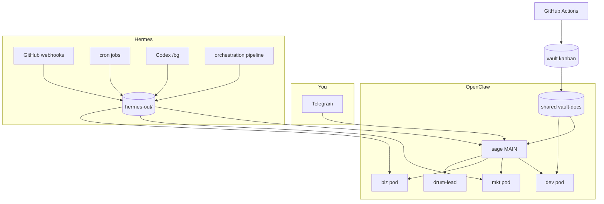

```mermaid
flowchart TB
  subgraph you [You]
    TG[Telegram]
  end
  subgraph oc [OpenClaw]
    SAGE[sage MAIN]
    DEV[dev pod]
    MKT[mkt pod]
    BIZ[biz pod]
    DRUM[drum-lead]
    MEM[(shared vault-docs)]
  end
  subgraph h [Hermes]
    WH[GitHub webhooks]
    CR[cron jobs]
    CX[Codex /bg]
    ORCH[orchestration pipeline]
    OUT[(hermes-out/)]
  end
  GH[GitHub Actions]
  VAULT[(vault kanban)]
  TG --> SAGE
  SAGE --> DEV
  SAGE --> MKT
  SAGE --> BIZ
  SAGE --> DRUM
  MEM --> SAGE
  MEM --> DEV
  WH --> OUT
  CR --> OUT
  CX --> OUT
  ORCH --> OUT
  OUT --> SAGE
  OUT --> MKT
  OUT --> BIZ
  GH --> VAULT
  VAULT --> MEM
```